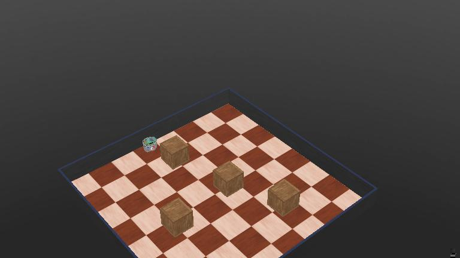

# Roomba-Style Obstacle Avoidance Robot 🚀🤖

This project is a simple robotic simulation using Webots that mimics the behavior of a Roomba. The robot is designed to navigate through its environment while avoiding obstacles using infrared distance sensors. This project serves as a learning exercise to understand basic robotic control, sensor integration, and obstacle avoidance algorithms.

---

## 🌱 Learning Journey

I'm currently exploring the fundamentals of robotics, focusing on sensor-based navigation and basic control systems. The goal is to build a foundational understanding of how robots perceive and interact with their surroundings using sensors.

---

## 🛠️ Project Overview

- **Simulation Platform:** Webots
- **Programming Language:** Python
- **Robot Model:** e-puck
- **Objective:** Implement a basic obstacle avoidance algorithm using infrared sensors.

---

## 🚀 How It Works

- The robot is equipped with multiple IR distance sensors (`ps0` to `ps7`) to detect obstacles in its path.
- The robot continuously monitors sensor values to determine proximity to objects.
- If an obstacle is detected in the front, the robot will reverse and turn away to avoid a collision.
- The movement algorithm is simple yet effective, resembling basic Roomba behavior.

---

## 🧠 Key Learning Points

- Understanding how IR sensors work to measure distance.
- Implementing sensor data processing to make navigation decisions.
- Developing a simple obstacle avoidance algorithm using conditional statements.

---

## 📸 Project Images

*E-puck robot navigating in Webots simulation environment*
---

## 🎥 Video Demo
## Watch the robot in action in the Webots simulation environment:
<video width="640" height="480" controls>
  <source src="./robot.mp4" type="video/mp4">
  Your browser does not support the video tag.
</video>

---
